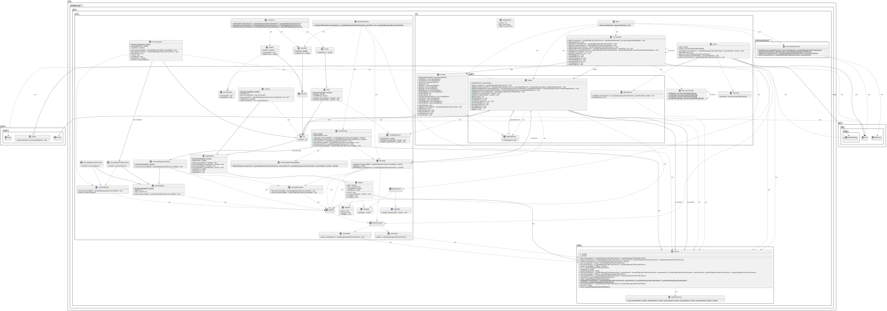
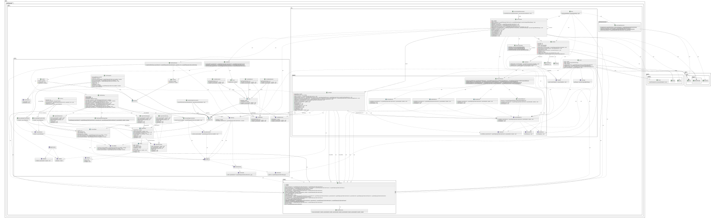

# Analysis
## Lab 3
### Dependencies
- There are a lot of highly needed dependencies, especially those that we have with the hierarchy of our different car classes, since they all have a lot of common factors such as position, speed and more. Then there is the dependencies we need through composition, specifically the LoadHelper classes that help to simplify the loading/unloading process with the objects that possess such attributes.

### Class Functions and Responsibility
- Our classes have their very own responsibility sectors if you would call it, as they only focus on the core function they need to fulfil. Apart from the CarView, CarController and DrawPanel classes, not a lot of dividing is possible here.
- They would change to limit the amount of functions needed per class and make it more clear what each class is meant for without having to dig through multiple statements and methods that generally don't relate to one another.
- It can be implemented in the CarView, DrawPanel and CarController classes, and we have already implemented in a way with our composition helper classes. They are split up into one parent class and 3 subclasses that define the 3 different way to load/unload something from an object instead of us having one class with all 3 different functions inside of it.

### Refactorization Plan
- Make everything as private as possible.
- Make all variables final by default.
- Move CarController, CarView and DrawPanel into new package `ui`.
- Move Vector2 into new package `math`.
- Add a new class `Vector2AwtExtensions` in a new package `mathawtextensions`. This class has the function `toPoint` to convert Vector2 to an awt Point. This is in a separate package since this doesn't make sense to include unless you are using awt. We don't want users of our packages to include more than they need.
- Pull out resources into a new singleton class `ResourcesHandler`. CarController selects the images and adds them using a function call on CarView.
- CarView becomes a singleton
- Each DrawPanel only holds one image and one position, and we instead use multiple instances of this class in a list in CarView.
- CarView then stores multiple DrawPanel inside a Map.
- CarView gets two new functions `addPanel` and `moveById` which add and move panels using an id. Selecting the id is handled by CarController and stored alongside its cars and workshops to allow it to update the correct one.
- Make CarController a singleton so CarView can access it without composing it.
- Pull out the entry point into a new class `Main` (Single Responsibility Principle).
- Create a new class `CarFactory` that instantiates the internal car classes such as Volvo240 (which we can now make package private). This helps decrease coupling between the main and ui packages.
- Create a new class `CanLoadUnorderedFactory` for the same reasons as CarFactory that creates workshops.
- Create a new interface `PositionFunctions` the extends HasPosition and Positionable.
- Create a new interface `GameObject` that implements the new interface `HasSprite` and PositionFunctions and has the function `getInner`.
- Create the new classes `GameObjectWrapWithSprite` and `GameObjectWrapWithInner` that wraps other objects into the GameObject interface.
- Create a new `GameObjectFactory` that creates cars and workshops with a sprite added. It is solely responsible for selecting the sprite for the game objects.
- CarController now has a list of `GameObject<Car>` and `GameObject<CanLoadUnordered>`.
- Add a new class `Model` that holds the cars and workshops. This follows MVC principle. CarController gets user input from CarView and updates CarModel. CarModel then updates CarView. Thus removing the two-way dependency we had before.

### Implementing in a team
One member would begin with separating everything into separate packages. You would then decide on an API between the packages. Then you could delegate out the modification of the packages to different teams. You would have occasional meetings and testing to make sure your teams are aligned.

## Lab 4
### Model-View-Controller
- From the start, the model and the controller bled together. The CarController held references to cars. CarController also needed to modify DrawPanel so it accessed CarView directly. CarController was not thin enough. It did a bunch of the logic that was supposed to be in a model.
- We added methods to manipulate DrawPanel in CarView to remove the dependency of DrawPanel from CarController, and we can now make drawPanel private in CarView. We did not have any planned way to communicate state changes from the model to the view. We tried to make a design using a GameObject interface but we scrapped while we were trying to implement it. We realised that the GameObject interface had a major problem. If we wanted to use it with a model the model would have to handle references to sprites. The model should be able to be used without sprites at all.
- Fixes made: CarView now holds a new class `Sprite` that holds only an image, position and angle. The Spite class implements a new `MoveObserver` interface that is stored in Model and is notified each time a car moves. The CarView class implements a new `UpdateObserver` interface that is stored in Model and is notified when all MoveObservers have been notified.
- 

### More design patterns
- Observer
    - Already used in Model. We used it to implement MVC in a correct way. With it we're able to remove a dependency from Model to CarView.
- Factory Method
    - Already used for creating cars and workshops. We used it to follow dependency inverstion priciple by making the internal implementation details of the different cars package private so external users have to depend on the factory and the higher up class Car.
- State
    - Could use it to make the cars state machine more robust.
- Composite
    - Would be used if there existed a Vehicle that could load itself.
- 
